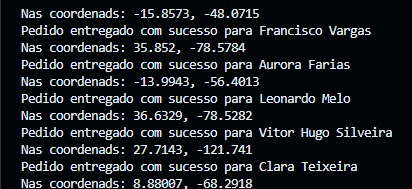

# Entrega poo

Repositorio destinado as demandas passadas em aula.

O makefile deste repositorio esta configurado para compilar na versão 20 do c++

## instalação
### msys
pode ser baixado [aqui](https://www.msys2.org/docs/installer/)

Apos a instalação do msys é necessario entrar no terminal proprio do msys.

atualiza banco de dados de pacotes: 
```
pacman -Syu
```

Atualiza restante dos pacotes basicos
```
pacman -Su
```
instalando gcc 64 bits: 
```
pacman -S mingw-w64-x86_64-gcc
```
instalando gcc 32 bits: 
```
pacman -S mingw-w64-i686-gcc
```

Tutorial de como fazer isso: [How to Download and Install C Cpp Toolset ( gcc g++ gdb ) in Windows 11 using mingw-w64 and msys2](https://www.youtube.com/watch?v=0HD0pqVtsmw)

## Códigos diferentes

### `try` e `catch` encontrado nas funções __(Novo padrão)__

Esses caras vão cuidar do tratamento de erros das funções. A ideia é retirar o retorno numerico dos metodos das classes.

__exemplo (GerenciadorVeiculos->adicionarVeiculo):__


O tratamento de exceções ocorre dentro da classe `GerenciadorVeiculo`, porque fica mais organizado o codigo, sem precisar ter um monte de `try\catch` na `main`.

## Fluxo de Desenvolvimento da Equipe (no caso so eu)

### branches

+ main: Codigo em "produção" (o deploy fica so na imaginação msm)
+ develop: codigo de desenvolvimento (a ideia é dar merge de uma branch diferente nessa, antes de levar ela para main)

## No Futuro

+ Quando o a atividade estiver com uma main minimamente aceitavel, vou adicionar releases com versões do programa.


# Tarefa 4: Cristhian Kapelinski
- implementada a classe DadosSistema na qual os dados do arquivo csv são lidos para realizar as entregas.
- a classe le o arquivo e entao transforma a string em coordenadas latitude longitude, usando GeoShell, um bash script criado pelo colega Diogo que busca as coordenadas no google maps.
- entao usando o gerenciador de pedidos é buscado um veiculo compativel com o peso da carga para transportalo, o veiculo achado entrega o pedido e é liberado, tendo as suas coordenadas modificadas para as coordenadas do local de entrega.
- Então é printado no terminal "Pedido entregado com sucesso para nome do cliente\n Nas coordenadas: latitude longitude;

- Try catchs foram usados no código para evitar quaisquer erro de parar completamente o programa, então se algum erro acontece apenas é printado no terminal que o erro ocorreu na entrega e o programa segue normalmente, como endereços invalidos e etc.
